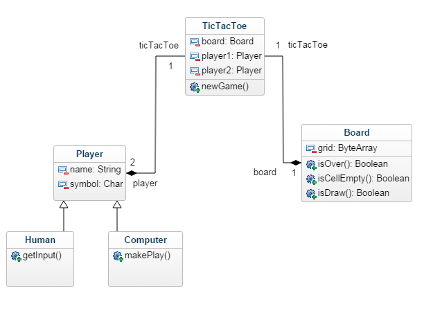

# 

# Design report

|Students                      |
|------------------------------|
|Daníel Örn Stefánsson         |
|Egill Anfinnsson Heinesen     |
|Ragnar Már Anfinnsson Heinesen|
|Eyrún Magnúsdóttir            |
|Haraldur Björnsson            |

## Introduction
Our initial goal was to implement the classic game of Tic Tac Toe as a desktop program.
The game of Tic Tac Toe consists of two players who are represented with the characters 'X' and 'O'. They play against each other on a 3 by 3 board, or a grid, where the goal is to form a horizontal, diagonal, or a vertical row with three identical characters. Initially the board is empty and each player moves in turn by placing its marker on a open cell. There are 8 possible winning conditions: {1, 2, 3}, {4, 5, 6} {7, 8, 9}, {1, 4, 7}, {2, 5, 8}, {3, 6, 9}, {1, 5, 9}, {3, 5, 7}. The player who succeeds first in forming a row with their character, wins. If all cells have been selected but no player has won, the game will result in a draw.

## Game design
- Our implementation of the game includes one human player, who always plays against the computer.
- The human player is always represented with the character 'X' and the computer is represented with the character 'O'.
- The player with the character 'X' always plays first. Therefore, human player always gets to go first, and the computer-player will always be second.

## Class design
We started the process by creating a simple and raw class diagram to get the overview needed before starting on the implementation of the game. During the implementation process we then realized that the having a separate class for the HumanPlayer was not needed so it was eliminated from the project. As one would expect a lot of functions and variables have also been added to these classes since this class diagram was created so it is not an accurate description of our implementation. The initial class diagram we based our design on can be seen on the next page.

Four main classes have been implemented, the Player.java and ComputerPlayer.java classes contain almost no logic, their purpose is simply to store the players name and symbol (e.g. : ‘Computer’, ‘O’). The ComputerPlayer.java class has a function which returns a random number between 0 and 8 to decide where on the board the computer “chooses” to place its symbol. There is not strategy implemented on behalf of the computer player, it simply always selects a random cell.
The Board.java class contains the logic behind the game grid as well as defining the winning conditions and checking if either player has won the game. The board is stored in a character array of size 9 and initialized with all cells empty, an empty cell is denoted by the whitespace character.

The user interface for the game is stored in the TicTacToe.java class whose purpose is to initiate the gameplay. The board is displayed and user is asked for its name and then a number from 1 - 9 to indicate which cell it wants to select. When the game is finished, the user is asked if he/she wants to play another game or abandon the game.

